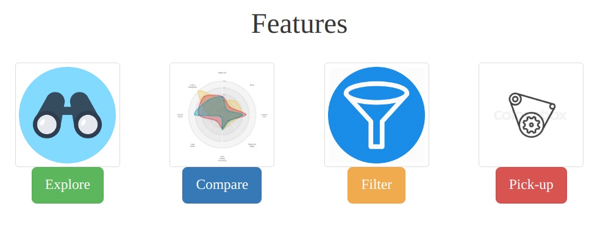
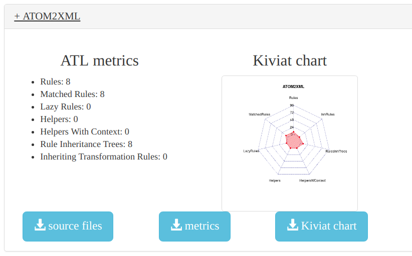
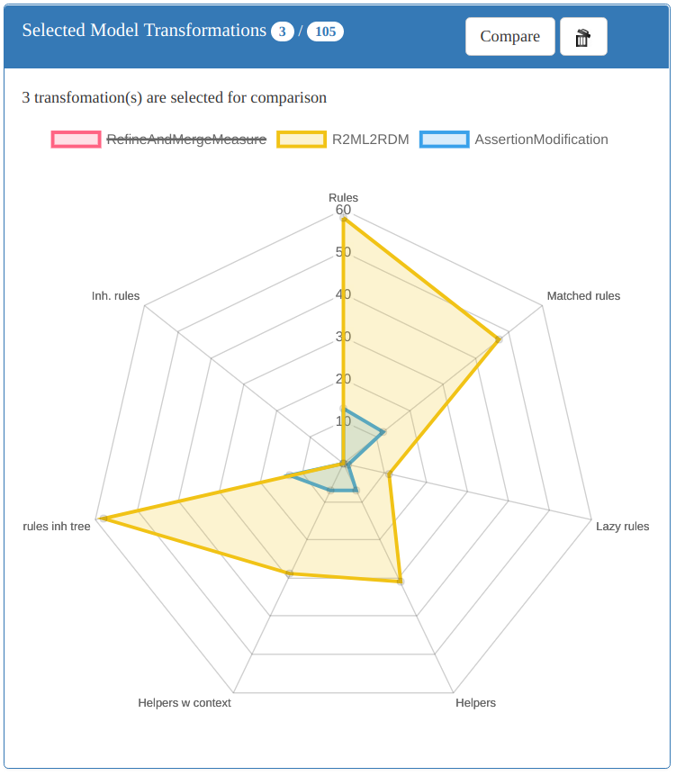
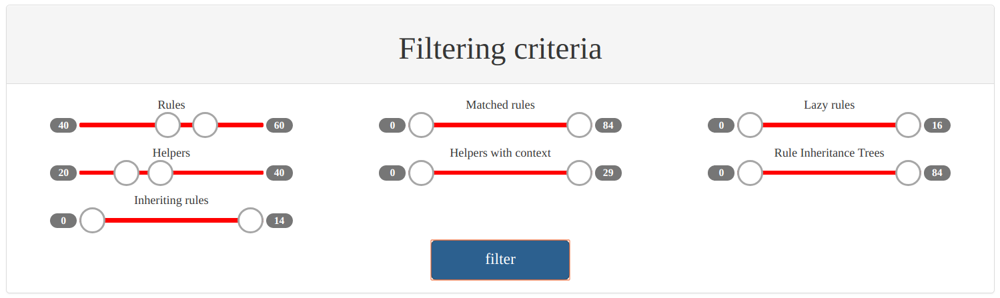
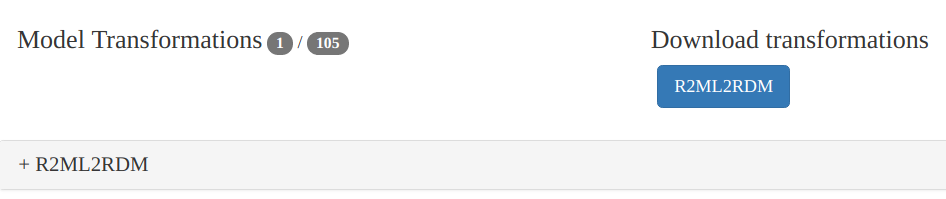
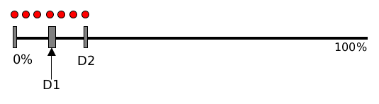
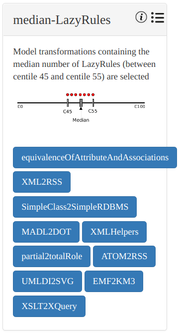
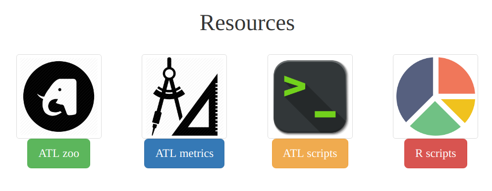

# Table of contents

1. [ATLpyta](#atlpyta)
	* [How to use ATLpyta](#how-to-use-atlpyta)
2. [Features](#features)	
	* [Explore the zoo](#explore-the-zoo)
	* [Graphical comparison](#graphical-comparison)
	* [Manual filtering](#manual-filtering)
	* [Automated pick-up](#automatic-pick-up)
3. [Resources](#resources)  	
4. [Team](#team)
5. [Contact](#contact-us)

# ATLpyta

The main purpose of **ATLpyta** (**p**ick **y**ou **t**ransform**a**tions) is to help ATL users in selecting model transformations for their experiments, among all the transformations of the ATL zoo.

Model Transformations are compared according to the following metrics: *#rules, #matched rules, #lazy rules, #inherited rules, #helpers, #helpers with context and depth of rules inheritance tree*. Users have access to all comparison data and to a user-friendly data visualisation.

Once a set of model transformations is selected (manually or automatically), you can download the corresponding source files. 

## How to use ATLpyta

**ATLpyta** is a web application. You can quickly use all the features by simply visiting the web site: [ATLpyta web site](https://atlpyta.github.io/).

# Features

This section describes the **4** main features of the tool. Each feature has a devoted sub-section.

## Explore the zoo

Here you are allowed to explore the *105* model transformations of the zoo. The MTs are viewed as a list.

You can expand each item of this list to view the details about the corresponding MT. This consist of two different views for the metrics: raw and graphical. Moreover, you can download the source files and the 2 different views of the metrics.

For more convenience, there are 3 different modes for sorting the model transformations while exploring the zoo: by name, by #rules or by #helpers.

## Graphical comparison

[Kiviat diagrams](https://en.wikipedia.org/wiki/Radar_chart) (also called radar charts or spider web charts) are used to graphically compare the model transformations according the previous metrics.

First, the user selects a list of model transformation. Then the tool generates an interactive Kiviat chart comparing the chosen MTs. 

#### Remarks

* You should select only few transformation (less than 10). Otherwise, comparison became harder. 
* Produced diagrams are interactive. You can click on the labels to display/hide the corresponding MT.
* It is possible to save a comparison diagram on your computer as well.

## Manual filtering 

The users can choose model transformations with specific constraints on the metrics. For example, one can say: "I want to select the MTs containing 40 to 60 rules and 20 to 40 helpers".

ATLpyta allows you to add such filters.

Then, you can download the source files of result model transformations.

## Automatic pick-up

If a manual filtering is not wished, then the user can choose the automatic pick-up mode. In this case, the tool picks up a set of model transformations, according to some selection strategies. The user only says which strategy he wishes to use.

Our selection strategies are divided into two categories:

- Mono-metric strategies
- Poly-metric strategies

### Mono-metric selection

In this case, the selection is performed according to one and only one metric. All the other metrics are ignored. For example, we can try to pick-up the set of transformations having the most diverse number of rules or helpers. In ATLpyta website, we implemented 4 mono-metric strategies for 3 metrics (rules, lazy rules and helpers). The strategies are: min, max, median and diverse.

The following schema illustrates the idea behind a mono-metric strategy. First, the sample of model transformations is divided in many blocks according to the selected metric and using the [centiles](https://en.wikipedia.org/wiki/Percentile) (C10, C20, ...). 

Then, 4 different selections are done:

- **Min** all the transformations having their value for the metric between 0 and C10 are selected
- **Max** all the transformations having their value for the metric between C90 and C100 are selected
- **Median** all the transformations having their value for the metric between C45 and C55 (around the median) are selected
- **Diverse** One model transformation is selected in each [decile](https://en.wikipedia.org/wiki/Decile)

When the number of selected model transformations is too high (>10), random data reduction is done in order to select at most 10 transformations.

### Poly-metric selection

## Resources

[Here](https://atlpyta.github.io/index.html#resources), you can find all the resources of this project:

* Raw ATL zoo
* ATL metrics source code
* All the bash scripts used to process the zoo and the metrics
* All the R scripts used to produce charts, statistics and selection strategies

## Team

TODO

## Contact us

TODO